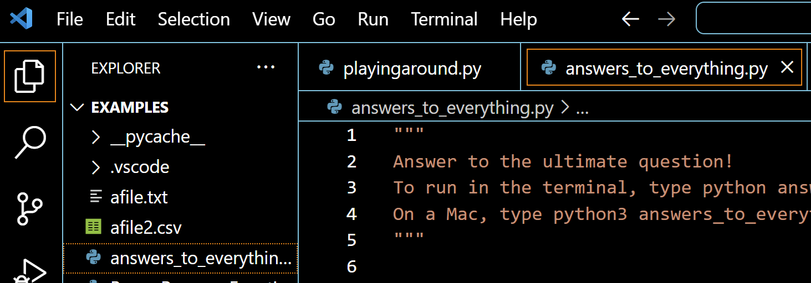

# ENGR 102 Lab Topic 11 (team)
There are three deliverables for this team assignment. Please submit the files below to **Canvas and Gradescope**. Please include the team header information at the top of each file with the names of all contributing team members. This is a team assignment, but **everyone** must submit the files for credit. You may discuss the problems with other teams, but your submitted work must be unique. Check out the [Frequently Asked Questions](#frequently-asked-questions) below.

## Activities

1. [Passport checker](#passport-checker)
   - [Part A](#part-a)
   - [Part B](#part-b)

## Passport checker
While waiting in the security line at the airport to start your amazing international vacation, you overhear one of the TSA agents state that they're having trouble with the passport scanner. With your newly acquired knowledge of reading and writing to files in Python, you agree to help them out.

First, take a look at the file provided to you named [scanned_passports.txt](scanned_passports.txt). Although initially it looks like junk, it actually contains information on all of the passports scanned so far. Your job is to figure out which passports have all of the required fields. The expected fields are

- `byr` – Birth year
- `iyr` – Issue year
- `eyr` – Expiration year
- `hgt` – Height
- `hcl` – Hair color
- `ecl` – Eye color
- `pid` – Passport ID
- `cid` – Country ID

Data for each passport is stored as a sequence of `key:value` pairs separated by a space or newline, and each passport scan is separated by a blank line. A valid passport must contain all fields, except for passport ID which is optional. For example,

```
ecl:gry pid:860033327 eyr:2029 hcl:#fffffd
byr:1937 iyr:2019 cid:147 hgt:183cm
```

is valid because all eight fields are present. However, the passport

```
hgt:189cm byr:1987 pid:572028668 iyr:2018 hcl:#623a2f
eyr:2030 ecl:amb
```

is NOT valid because it is missing `cid`, the Country ID. The passport

```
cid:532 iyr:2017 hgt:154cm eyr:2031
byr:1941 hcl:#12fe04 ecl:amb
```

IS valid because the only missing field is `pid`, the passport ID field, which is optional. 

### Part A
**BEFORE WRITING ANY CODE** create a document named `passport_checker_planning.pdf` that includes a hierarchy for Part A and five (5) test cases. Your test cases should be NEW and not found in the provided files. **AFTER** you plan your program, write the code.

Write a program named `passport_checker.py` that takes as input from the user a filename (like `scanned_passports.txt`), reads the file, counts the number of valid passports, then writes the valid passport scans to a new file named `valid_passports.txt`. Format your program's output using the example shown below. Format your new file using the same format as the input file; write the data for each passport **exactly as shown** in the input file with one blank line between valid passports.

Example output using `scanned_passports.txt`:
```
Enter the name of the file: scanned_passports.txt
There are ??? valid passports
```

Example `valid_passports.txt` file:
```
hgt:69in iyr:2019 byr:1941 pid:956152259 ecl:hzl cid:424
eyr:2029 hcl:#0e9c75

hcl:#649082
eyr:2032 pid:713381131 byr:1967 iyr:2026 ecl:hzl hgt:184cm cid:021

...
```

### Part B
<details>
<summary>Click to reveal!</summary>
The security line is now moving at lightning speed! But now the TSA agents are worried that some of the "valid" passports are actually invalid. It turns out that each of those required fields has rules about what values are valid.

- `byr` – Birth year – four digits, between 1922 and 2010, inclusive
- `iyr` – Issue year – four digits, between 2016 and 2026, inclusive
- `eyr` – Expiration year – four digits, between 2026 and 2036, inclusive
- `hgt` – Height – a number followed by either `cm` or `in`
  - If `cm`, the number must be between 150 and 193, inclusive
  - If `in`, the number must be between 59 and 76, inclusive
- `hcl` – Hair color – a `#` followed by exactly 6 characters (`0`-`9` or `a`-`f`)
- `ecl` – Eye color – exactly one of the following: `amb`, `blu`, `brn`, `gry`, `grn`, `hzl`, `oth`
- `pid` – Passport ID – not required
- `cid` – Country ID – a three-digit number, NOT including leading zeroes

**BEFORE WRITING ANY CODE** for Part B, add to your planning document a hierarchy for Part B and five (5) NEW test cases based on the new criteria. **AFTER** you plan your program, write the code.

Write a program named `passport_checker2.py` that takes as input from the user a filename, reads the file, counts the number of valid passports based on the rules above, then writes the valid passport scans to a new file named `valid_passports2.txt`. Format your program's output and your new file using the same format as Part A.
</details>

## Frequently Asked Questions
1. **What do I submit where?** Submit your pdf planning document named `passport_checker_planning.pdf` to **Canvas** for manual grading. That should include your top-down design (hierarchy) and your test cases for Part A and Part B. That's 2 hierarchies, and a total of ten (10) test cases. Submit your python files `passport_checker.py` and `passport_checker2.py` to Gradescope for autograding.

2. **I downloaded the input file and tried to run my code, but I get the error "No such file or directory". What does that mean?** You need to make sure the input file is stored in the same folder as your ~.py file. Check your Downloads folder to find the file, then move it to whatever folder you saved your code to. If you're not sure where you saved your code, check the Explorer menu on the left in VS Code. You can click File > Open Folder to select a different directory, and highlight the bar at the top of the window to see the current directory. See the screenshots below. If your input file is in the right place, you should see both it and your code in the Explorer menu on the left.



4. **I can't get my code to pass the 4 point file created correctly test case. Do I get the points anyway?** No! This part of the lab is fully autograded, so your grade is whatever you see on Gradescope. We will NOT run your code or manually change your grade. If you are struggling to pass this test case, check the format of your file. It needs to look EXACTLY like the input file, but with all of the non valid passports removed. That means valid passports only, with a blank line in between, and the SAME formatting as the original.

5. **There is a test case that uses a different input file. Can I see it?** Nope! The different input file has the same format as the one provided above, it just has more passports. Your code should be able to handle ANY input file with the same format. If it can't, that probably means you hardcoded something. One of the reasons that engineers write code is to open, process, and output data from files. If you have to process 100+ files of the same format, you're going to want one program to work for all of them. You really don't want 100+ programs. Trust me, I know from experience.

6. **Do I need to submit my `valid_passports.txt` and `valid_passports2.txt` files?** Nope! The autograding code on Gradescope will run your submitted `passport_checker.py` and `passport_checker2.py` codes, create the output files that your code (should) generate, then check them. If you submit txt files, the autograder will not run.

7. **This problem is so much fun! How do you come up with these?** This particular problem is a modified version of a problem from [Advent of Code 2020](https://adventofcode.com/2020). Yes, I solve coding problems for fun in my free time. If you're interested in majoring/minoring in computer science or any computational engineering field, I highly recommend trying it out!

Have a question you don't see here? Email your instructor!

Based on Advent of Code 2020<br/>
Revised Summer 2026 SNR
